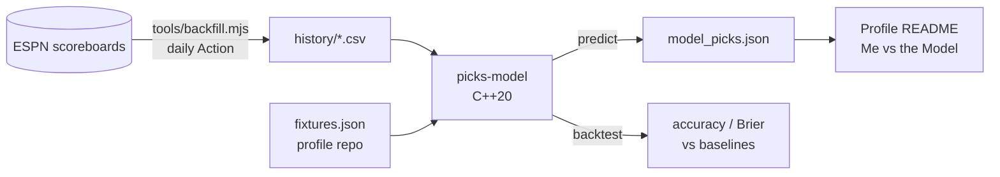

# picks-model

**Me vs the Model.** I pick soccer, NBA and NHL games on my phone, and my
[GitHub profile](https://github.com/AdrianShah) keeps score. This repo is the
opponent: a small C++20 program that rates every team from past results and
picks the same games, under the same rules, before kickoff.



## Models

| Sport | Model of record | Output |
|---|---|---|
| Soccer | Dixon–Coles goals model | P(home), P(draw), P(away), so it can pick a draw |
| NBA | Elo, FiveThirtyEight-style margin of victory | P(home), P(away) |
| NHL | Elo, logarithmic margin of victory | P(home), P(away) |

**Elo** ([src/elo.cpp](src/elo.cpp)): the usual `1 / (1 + 10^(-diff/400))` expectation with a
home-advantage bonus (none at neutral sites). Updates are scaled by the winning margin, damped
when a favourite wins so that ratings don't run away. After a break longer than the offseason
threshold, a team keeps only part of its distance from the average (75% in the NBA).

**Dixon–Coles** ([src/goals.cpp](src/goals.cpp)): every team has an attack and a defence strength,
and goals are Poisson:

```
home goals ~ Poisson(exp(level + home_edge + attack[home] - defence[away]))
away goals ~ Poisson(exp(level + attack[away] - defence[home]))
```

Strengths are fitted *online*: after each game, one gradient step on the Poisson log-likelihood
(observed minus expected goals). New teams learn faster (`1 / (games + 10)`) until they settle.
Outcome probabilities sum the score grid with the Dixon–Coles correction, which makes 0-0 and
1-1 more likely than independent Poissons predict. Because the fit is online, the whole thing
replays walk-forward with no look-ahead.

Soccer history covers every ESPN league at once (about 170 games a day), so cup and
European games link the domestic leagues into one rating pool. Women's competitions are left
out ([config/competitions.json](config/competitions.json)), because ESPN often gives women's
teams the same names as men's.

## Backtest

`picks-model backtest` replays history in order. Every model predicts each game from earlier
games only, then learns from it. The first year only trains the models, and a game is scored
only once both teams have 10 games behind them.

Baselines: **Always home**, **Better record** (more points per game this season) and
**Base rate** (the league's home/draw/away frequencies, which is the Brier score to beat).
Brier is the multi-class form, where 0 is perfect and a 50/50 guess on a two-way game scores 0.5.

<!-- BACKTEST:START -->
History from July 2022 (soccer) and October 2022 (NBA/NHL) to September 2026; scored from the
second season on.

| Sport | Games scored | Model | Accuracy | Brier | Always home | Better record | Base-rate Brier |
|---|---:|---|---:|---:|---:|---:|---:|
| Soccer (3-way) | 67,273 | Dixon–Coles | **49.4%** | **0.6090** | 44.7% | 45.3% | 0.6465 |
| NBA | 3,962 | Elo | **66.4%** | **0.4215** | 54.9% | 64.6% | 0.4958 |
| NHL | 4,172 | Elo | **57.3%** | **0.4803** | 54.1% | 55.3% | 0.4971 |

Soccer Elo, for comparison: 49.0%, Brier 0.6158. The full replay of about 109,000 games takes
under a second.
<!-- BACKTEST:END -->

## Usage

```bash
cmake -S . -B build -DCMAKE_BUILD_TYPE=Release
cmake --build build --parallel
ctest --test-dir build --output-on-failure

./build/picks-model backtest --history history                  # all sports
./build/picks-model backtest --history history --sport nba --set elo.k=24
./build/picks-model ratings  --history history --sport nhl --top 10
./build/picks-model predict  --history history \
    --fixtures ../AdrianShah/data/fixtures.json --out model_picks.json \
    --config config/competitions.json
```

On Windows without Visual Studio, [LLVM-MinGW](https://github.com/mstorsjo/llvm-mingw)
(`winget install MartinStorsjo.LLVM-MinGW.UCRT`) works; add
`-G "MinGW Makefiles" -DCMAKE_CXX_COMPILER=clang++` to the first command. The runtime is linked
statically, so the `.exe` runs anywhere.

History is refreshed daily by [update-history.yml](.github/workflows/update-history.yml). To
rebuild it from scratch (Node 18+, no dependencies):

```bash
node tools/backfill.mjs                                   # 2022 onwards, all sports
node tools/backfill.mjs --sport nba --from 2024-10-01     # one sport, one range
node tools/backfill.mjs --incremental                     # just the new days
```

## Fairness rules

`predict` only picks games whose status is `upcoming` and that haven't started, and it trains
only on games that finished before the run. It then merges with the previous `model_picks.json`:

- once a game has started, its pick is frozen for good;
- an unchanged pick keeps its original `lockedAt`, so `lockedAt < scheduledAt` always holds;
- a changed pick before kickoff gets a new `lockedAt`, the same as when I change mine in the app.

Output uses the app's conventions (`pick` is a team name or `"draw"`), plus the probabilities:

```json
{"eventId":"espn:hockey:nhl:401891827","sport":"nhl","competition":"NHL","a":"Toronto Maple Leafs","b":"Montreal Canadiens","scheduledAt":"2026-10-08T23:00:00Z","lockedAt":"2026-09-27T21:00:00Z","pick":"Toronto Maple Leafs","pA":0.5812,"pB":0.4188}
```

## Engineering notes

- C++20, CMake, **no third-party dependencies**. The CSV reader (RFC 4180), JSON parser/writer
  (UTF-8 escapes, surrogate pairs, depth limit) and test harness are all in this repo.
- Every model implements one `Predictor` interface (`predict` / `observe`), so the backtester,
  the CLI and the tests treat Elo, Dixon–Coles and the baselines the same way.
- CI builds on Linux (GCC) and macOS (Clang) with AddressSanitizer + UBSan and warnings as errors,
  and on Windows with MSVC.

```
include/picks/   public headers
src/             models, parsing, backtest, CLI (main.cpp)
tests/           unit tests + CLI smoke tests on tests/data
tools/           backfill.mjs (ESPN → history/*.csv)
history/         <sport>/<year>.csv, one row per finished game
config/          competition filter, ESPN league-name cache
```
